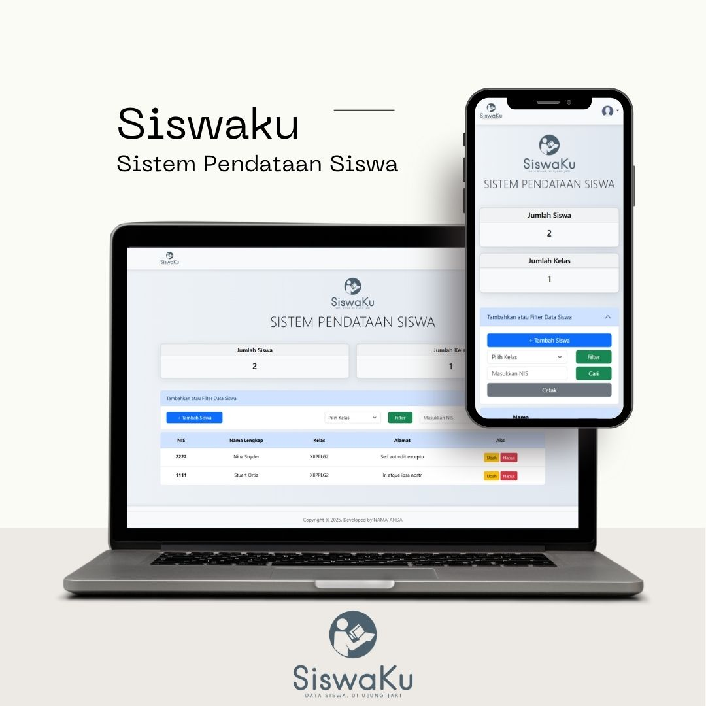
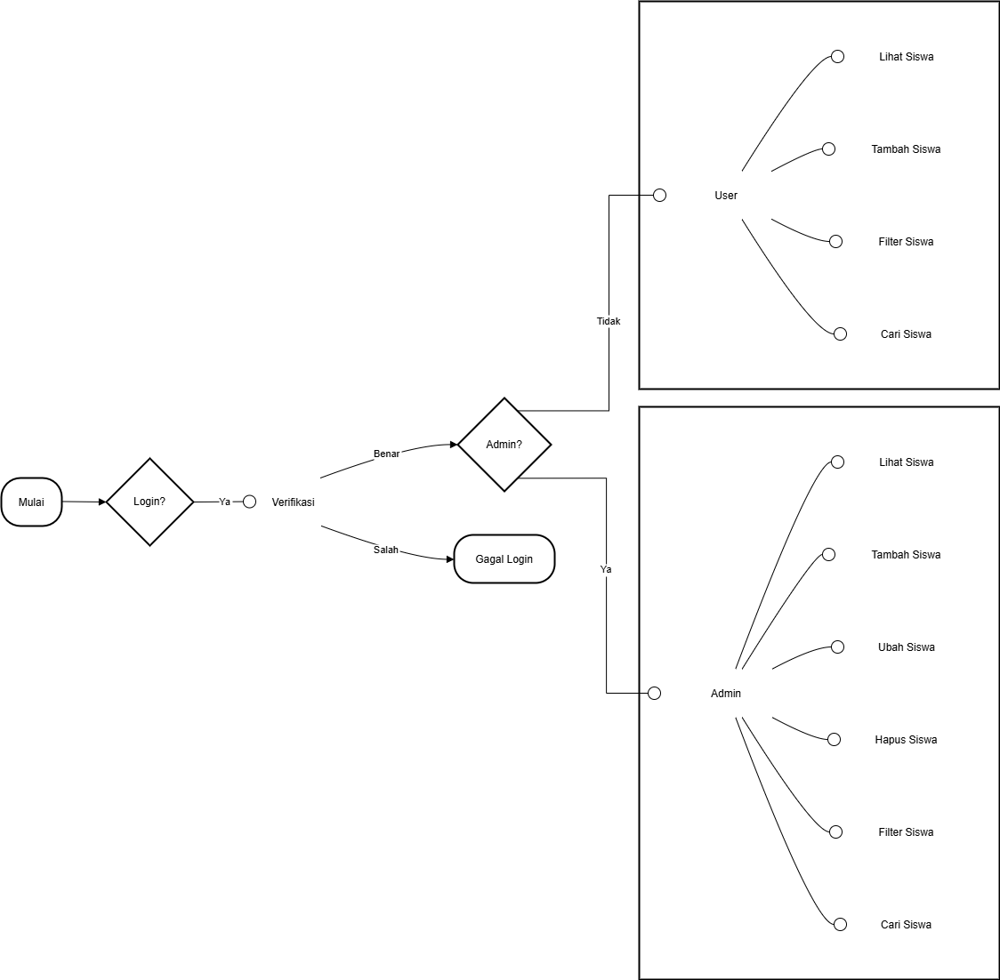
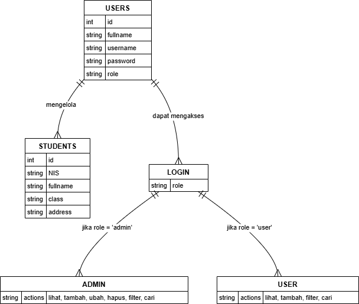
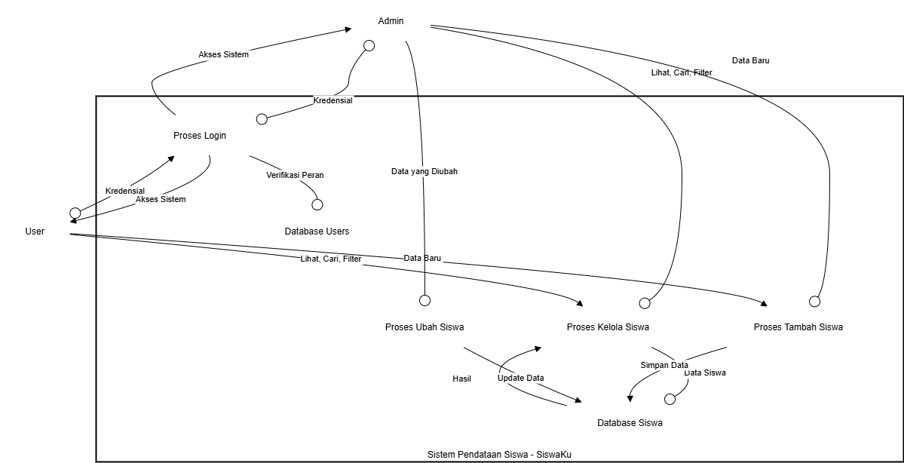

# SiswaKu

## Deskripsi

SiswaKu adalah sebuah sistem pendataan siswa yang dirancang untuk memudahkan pengguna dalam mengelola dan memfilter data siswa. Website ini menyediakan antarmuka yang ramah pengguna untuk menambah, memperbarui, dan menghapus catatan siswa. Dengan fitur autentikasi dan otorisasi pengguna, SiswaKu memastikan memberikan pengalaman penggunaan yang responsif di berbagai perangkat, baik mobile maupun desktop.

## Fitur

- Autentikasi dan otorisasi pengguna
- Pengelolaan data siswa
  - Lihat data siswa
  - Tambah data siswa
  - Perbarui data siswa
  - Hapus data siswa
  - Filter data siswa berdasarkan kelas
  - Cari data siswa berdasarkan NIS
  - Cetak data siswa
- Desain responsif untuk perangkat mobile dan desktop

## Teknologi yang Digunakan

- **PHP**: Bahasa pemrograman server-side yang digunakan untuk mengembangkan fitur-fitur dinamis pada website ini.
  - **Referensi**: https://www.w3schools.com/php/
- **HTML**: Bahasa markup yang digunakan untuk membuat struktur dan konten dari halaman web.
  - **Referensi**: https://www.w3schools.com/html/
- **CSS**: Digunakan untuk mendesain dan mengatur tampilan dari halaman web agar lebih menarik dan responsif.
  - **Referensi**: https://www.w3schools.com/css/
- **MySQL**: Sistem manajemen basis data yang digunakan untuk menyimpan dan mengelola data siswa secara efisien.
  - **Referensi**: https://www.w3schools.com/MySQL/
- **Bootstrap**: Framework CSS yang digunakan untuk mempercepat pengembangan antarmuka pengguna yang responsif dan modern.
  - **Referensi**: https://getbootstrap.com/docs/5.3/getting-started/introduction/

## Arsitektur

SiswaKu dibangun menggunakan arsitektur Model-View-Controller (MVC). Arsitektur ini membagi aplikasi menjadi tiga bagian yaitu:

- Model: berisi logika bisnis dan data yang digunakan oleh aplikasi.
- View: berisi kode-kode HTML yang digunakan untuk menampilkan data ke pengguna.
- Controller: berisi logika yang digunakan untuk mengatur alur aplikasi dan berinteraksi dengan model dan view.
  - **Referensi**: https://www.dicoding.com/blog/apa-itu-mvc-pahami-konsepnya/

## Struktur Folder

Struktur folder website SiswaKu terdiri dari beberapa folder dan file utama, yaitu:

### File Utama

- `index.php`: file utama yang berfungsi sebagai pintu masuk aplikasi
- `config.php`: file konfigurasi yang berisi informasi tentang database dan pengaturan aplikasi
- `.htaccess`: file konfigurasi Apache yang berfungsi untuk mengatur routing URL aplikasi

### Folder

- `assets`: folder yang berisi file-file statis seperti gambar, CSS, dan JavaScript
- `controllers`: folder yang berisi file-file controller yang berfungsi untuk mengatur alur aplikasi dan berinteraksi dengan model dan view
- `helpers`: berisi fungsi-fungsi yang digunakan untuk memudahkan pengembangan aplikasi
- `models`: berisi model-model yang digunakan untuk berinteraksi dengan database
- `views`: berisi kode-kode HTML yang digunakan untuk menampilkan data ke pengguna

## Flowchart

Berikut adalah flowchart dari website SiswaKu:

## Context Diagram

Berikut adalah context diagram dari website SiswaKu:

## Entity Relationship Diagram (ERD)

Berikut adalah ERD dari database SiswaKu:

## Data Flow Diagram (DFD)

Berikut adalah DFD dari website SiswaKu:

## Instalasi

1. Kloning repository dengan cara klik tombol Code (warna hijau) di atas dan pilih "Download ZIP" atau menggunakan perintah `git clone` di terminal
2. Ekstrak file ZIP yang Anda download
3. Buat database MySQL dengan nama `siswaku_db` dan import file `database.sql
4. Konfigurasi file `config.php` dengan informasi database Anda
5. Jalankan aplikasi dengan perintah `php -S localhost:8000` di terminal atau gunakan XAMPP/WAMP/LAMP/Laragon untuk menjalankan aplikasi

## Penggunaan

1. Jalankan aplikasi dengan perintah `php -S localhost:8000` di terminal atau gunakan XAMPP/WAMP/LAMP/Laragon untuk menjalankan aplikasi
2. Akses website di browser web Anda di `http://localhost:8000`
3. Masuk dengan kredensial Anda atau buat akun baru:
   - Admin : `admin` / `admin`
   - User : `user` / `user`
4. Explore fitur-fitur website dan mulai mengelola data siswa Anda

## Screenshot

Berikut adalah beberapa screenshot dari website SiswaKu:

### Desktop

- Halaman Login
  
- Halaman Kelola Siswa
  
- Halaman Tambah Siswa
  
- Halaman Ubah Siswa
  

### Mobile

- Halaman Login

- Halaman Kelola Siswa

## License

This project is licensed under the [MIT License](LICENSE).
